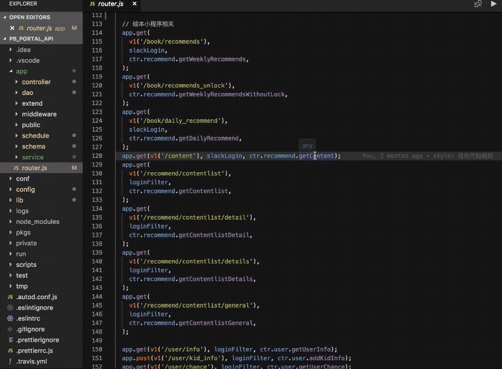

# Egg Definition

## 功能及原理

实现 Egg 框架中 router, controller, service 文件/目录中的定义跳转

原理是通过全局搜索该变量名找到定义，并对结果进行筛选，当只有一个匹配结果时，会直接跳转到该定义，否则会给用户选择最合适的结果跳转

> route 的定义只会在 controller 中寻找，同理，controller 在 service 中寻找， service 在 service 及 dao（如有）中寻找

> 确保 Visual Studio Code 版本在 1.27.0 以上

## 使用方法

焦点放在关键词或选中关键词，然后执行以下方法的其中一种
- 快捷键: cmd + 1
- 快捷键: F1 + 输入 Egg Definition
- 鼠标: 右键 + Egg Definition

## 已知问题

- [ ] 举个栗子，在 controller 中搜索, 如果 service 中定义多个名字相同的方法，会同时出现给用户选择，暂时无法做到非常精确的匹配

## 更新记录

### 0.0.1

- 实现基本的跳转功能